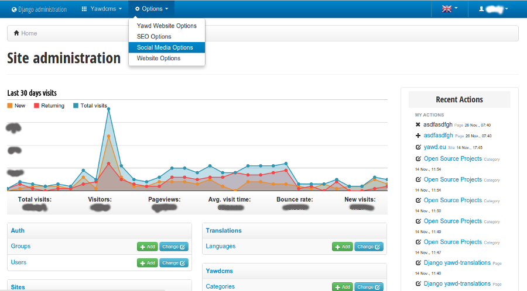

yawd-admin, a django administration website
======================================================

`yawd-admin <http://yawd.eu/open-source-projects/yawd-admin/>`_ is an 
administration website for django. It extends the default django admin 
site and offers the following:

* A clean and beautiful bootstrap user interface
* Hand-written pure HTML5/CSS3 code with indented HTML output
* Register custom database settings (options) editable from the UI. You can use all **standard django form fields** for these settings
* Integration with google analytics for displaying statistics in the admin home page
* Register your applications to the top-bar navigation
* Refurbished original django admin widgets
* Mechanism for opening the original django admin popup windows with fancybox
* Seamless integration with `yawd-translations` for multilingual admin websites

Usage and demo
==============

See the `yawd-admin documentation <http://yawd-admin.readthedocs.org/en/latest/>`_ 
for information on how to install the demo and use yawd-admin.
