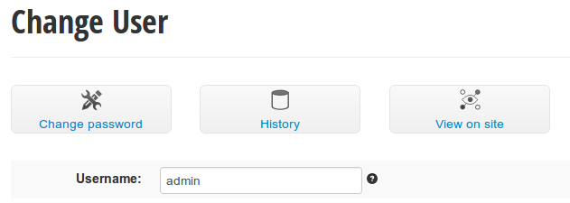
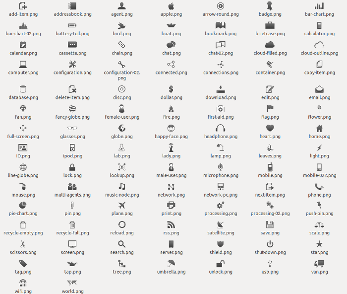

Customizing yawd-admin
======================

Overriding the templates
++++++++++++++++++++++++

As with the default django admin site you can override the templates of
yawd-admin. Just make sure your application is listed before 'yawd-admin'
in your ``INSTALLED_APPS`` settings and place your templates inside the
`myapp/templates/admin` directory.
`Per-model template override <https://docs.djangoproject.com/en/dev/ref/contrib/admin/#set-up-your-projects-admin-template-directories>`_ 
works exactly like the original django admin as well.

Object tools
------------

The object tools in yawd-admin look like in the following screenshot (taken
from the ``User`` model change page):

The html in templates for object tools is like this:

.. code-block:: django

	
	

		<a href="history/" class="big-button">
			<i class="database-item"></i> 
		</a>
	

	

		<a href="../../../r/{{ content_type_id }}/{{ object_id }}/" class="big-button">
			<i class="lookup-item"></i> 
		</a>
	

	
Since you might override the `'object-tools-items'` template block to add
your custom object tools, yawd-admin provides a set of icons to
use for your buttons.

To use the above icons you must use an an ``{{iconname}}-item`` class
where ``{{iconname}}`` is the name of the icon. E.g.:

.. code-block:: django

	 <i class="male-item"></i>
	 <i class="mobile-item"></i>
	 <i class="plane-item"></i>

Some icon names have an `'-item'` suffix on their own, you should leave the
icon name as is in this case. E.g.:

.. code-block:: django

	 <i class="add-item"></i>
	 <i class="copy-item"></i>

"My account" view
+++++++++++++++++

yawdadmin comes with a new admin view to allow staff users edit their own
account information (username,  first name, last name and email). This view
uses a ModelForm of the standard ``django.contrib.auth.models.User`` model.

If your projects makes use of the
`new django 1.5 custom user functionality <https://docs.djangoproject.com/en/dev/topics/auth/customizing/#auth-custom-user>`_
you can set the ``ADMIN_USER_MODELFORM`` yawd-admin setting to override the 
ModelForm used by the view (in settings.py):

.. code-block:: python

	ADMIN_USER_MODELFORM = 'myapp.module.MyModelForm'

Note that the setting value can be a string or Class. A string is normally
preferred to avoid import errors during environment initialization.
.