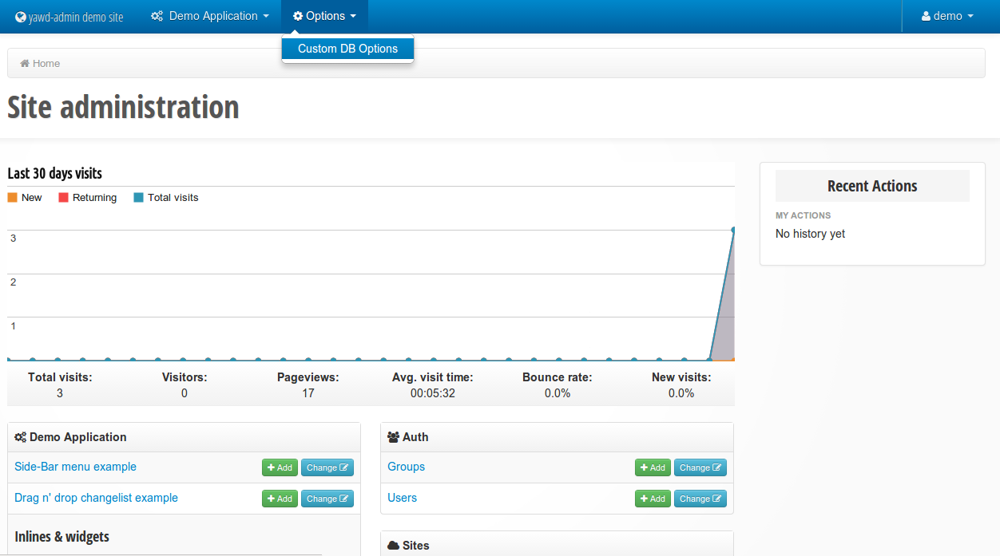

.. yawd-admin documentation master file, created by
   sphinx-quickstart on Sat Dec  1 15:47:57 2012.
   You can adapt this file completely to your liking, but it should at least
   contain the root `toctree` directive.

yawd-admin django application documentation
===========================================

`yawd-admin <http://yawd.eu/open-source-projects/yawd-admin/>`_ is an
administration website for django. It extends the default django admin site
and offers the following:

* A clean and beautiful bootstrap user interface
* Hand-written pure HTML5/CSS3 code with indented HTML output
* Responsive interface, optimized for mobile phones and tablets
* Register custom database settings (options) editable from the UI. You can use all **standard django form fields** for these settings
* Integration with google analytics for displaying statistics in the admin home page
* Register your applications to the top-bar navigation
* Refurbished original django admin widgets
* Mechanism for opening the original django admin popup windows with fancybox
* Seamless integration with `yawd-translations` for multilingual admin websites

Screenshot of the yawd-admin index page (taken from the 
`http://yawd.eu/ <http://yawd.eu/>`_ production website).

Contents:

.. toctree::
   :maxdepth: 2

   installation
   usage
   customize

Indices and tables
==================

* :ref:`genindex`
* :ref:`modindex`
* :ref:`search`

