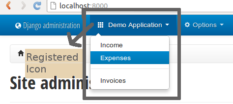
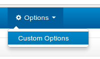
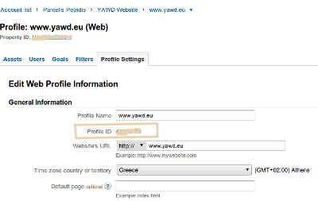
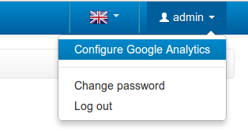
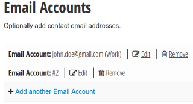
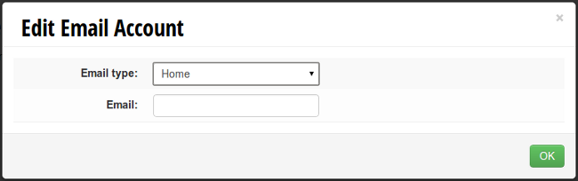
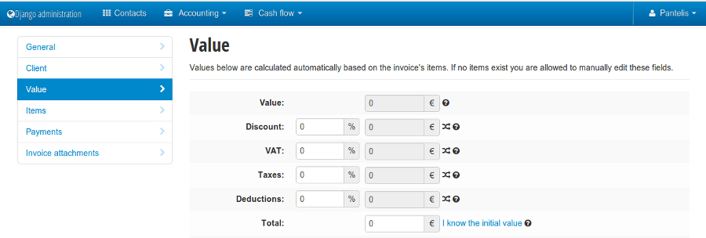
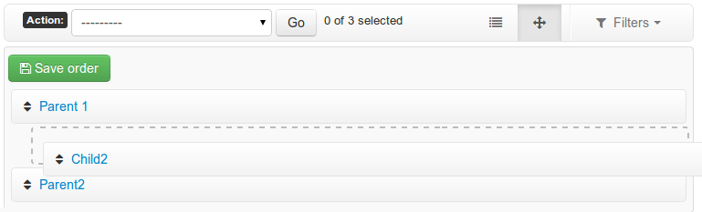

Using yawd-admin
================

.. _setup:

Set up
++++++

To use the yawd-admin website you first need to include yawdadmin in
your ``INSTALLED_APPS`` setting. You also not need to include
`django.contrib.admin` in ``INSTALLED_APPS`` and place
it **after** `yawdadmin` for yawd-admin to work properly. In `settings.py`:

.. code-block:: python

	INSTALLED_APPS = (
		...
		'yawdadmin',
		'django.contrib.admin',
		...
	)

yawd-admin uses the :class:`yawdadmin.middleware.PopupMiddleware` middleware
to replace the  standard django admin popups with fancybox. Make sure the
middleware is enabled in your ``MIDDLEWARE_CLASSES`` setting. In `settings.py`:

.. code-block:: python

	MIDDLEWARE_CLASSES = (
		...
		'yawdadmin.middleware.PopupMiddleware',
		...
	)

Finally, the `django.core.context_processors.request` context
processor must also be enabled:

.. code-block:: python

	TEMPLATE_CONTEXT_PROCESSORS = (
		...
		"django.core.context_processors.request",
		...
	)

.. register-urls:

Register the yawd-admin urls
++++++++++++++++++++++++++++

To register the admin site views, use the following (inside your `urls.py`):

.. code-block:: python

	from yawdadmin import admin_site

	patterns = (''
		url(r'^admin/', include(admin_site.urls)),
		...
	)

You **do not** need to register the django admin urls as well, the
yawd ``admin_site`` extends the original admin class.

.. settings:

Settings
++++++++

You can change the admin site name and add a description to the login page
by adding a couple attributes to your settings:

.. code-block:: python
	
	ADMIN_SITE_NAME = 'My Admin Site'
	ADMIN_SITE_DESCRIPTION = 'This is a private site.  Please don't hack me'

If you don't want a description at all just null the attribute:

.. code-block:: python

ADMIN_SITE_DESCRIPTION = None

To set a logo that will show up in the right side of the header:

..code-block:: python

ADMIN_SITE_LOGO_HTML = '
Logo
'

With yawd-admin you can optionaly disable the app index view (the one that lists an application's 
models). Doing so will raise "Page Not Found" (404) errors when accessing the application urls and
will also hide all corresponding links from breadcrumbs.

..code-block:: python

ADMIN_DISABLE_APP_INDEX = True 

.. _auto-discover:

ModelAdmin registration and auto-discovery
++++++++++++++++++++++++++++++++++++++++++

Normally, to register your normal ModelAdmin class with yawd-admin you
should use ``yawdadmin.admin_site`` instead of the original
``django.contrib.admin.site`` instance (in `admin.py`):

.. code-block:: python

	from django.contrib import admin
	from models import MyModel

	class MyModelAdmin(admin.ModelAdmin):
		pass

	from yawdadmin import admin_site
	#you can use this instead of admin.site.register():
	admin_site.register(MyModel, MyModelAdmin)

However, many applications might have registered their `ModelAdmin`
classes with the default django admin site. As you can see from the
above snippet yawd-admin uses the `ModelAdmin` class as well, therefore
you can easily add all standard registrations to the yawd-admin website.
To do so, use the standard `admin.autodiscover()` method and then update
the yawd-admin registry as follows (in `urls.py`):

.. code-block:: python

	from django.contrib import admin
	from yawdadmin import admin_site

	admin.autodiscover()
	admin_site._registry.update(admin.site._registry)

.. _top-bar:

Top-bar navigation
++++++++++++++++++

yawd-admin provides a top navigation bar. If you wish, you can register
an application's admin models along with an accompanying image to the
top-bar as follows:

.. code-block:: python

	from yawdadmin import admin_site
	admin_site.register_top_menu_item('sites', icon_class="icon-th")

The ``icon_class`` argument can be any icon from the ones that ship
with bootstrap, found `here <http://twitter.github.com/bootstrap/base-css.html#icons>`_.

The above snippet will register the `django.contrib.admin.sites` application to
the top bar. Note however that if the application you try to register
is not yet registered with the admin website, an Exception will be raised.
Therefore, a safe place to put this code is in your `urls.py module`, right
after the :ref:`auto-discovery <auto-discover>` code. If you want to register the current
application, you could use the `admin.py` module and place the code right
after the `ModelAdmin` registrations (as in the :ref:`demo project <demo-project>`).

A screenshot of the top-bar navigation from the demo project. Note that the
order in which `ModelAdmin` classes are presented in the drop-down box
is not alphabetical and that there is also a separator line between
the `Expenses` and `Invoices` items. yawd-admin provides two custom
`ModelAdmin` attributes to achieve this behavior:
``order`` and ``separator``. You can use them like this:

.. code-block:: python

	class MyCategoryAdmin(admin.ModelAdmin)
		... #bla bla..
		order = 2

	class MyPageAdmin(admin.ModelAdmin)
		... #bla bla..
		order = 1

	class MyThirdAdmin(admin.ModelAdmin)
		... #bla bla..
		order = 3
		separator = True

The above will place `MyPageAdmin` before `MyCategoryAdmin` and
`MyThirdAdmin` will come last. A separator line will also be drawed
**before** the `MyThirdAdmin` item.

If you do not set a custom `ModelAdmin` order, yawd-admin will use the
standard alphabetical order for your models.

You can exclude a certain model from the top-bar navigation. To do so
set the ``exclude_from_top_menu`` attribute to True:

.. code-block:: python

	class MyExcludedAdmin(admin.ModelAdmin)
		... #bla bla..
		exclude_from_top_menu = True

Custom top-bar menus
--------------------

In addition to the app/model-driven top bar menus, you can also create
custom menus. To do that you should use the ``register_top_menu_item``
method, specifying child menu items like this:

.. code-block:: python

	from yawdadmin import admin_site
	admin_site.register_top_menu_item('Custom menu', icon_class="icon-th",
		children=[{'name': 'Custom view 1', 'admin_url': reverse_lazy('custom-url-view'), 'order': 1, 'title_icon': 'icon-hand-left' },
		          {'name': 'Custom view 2', 'admin_url': reverse_lazy('custom-url-view-2'), 'order': 2, separator: True, 'title_icon': 'icon-hand-right' }],
	perms=perms_func)

The ``children`` keyword argument must be a list holding the actual sub-menu items.
Each item in this list must be a dictionary with the following keys:

* *name*: The menu item name. **Required**
* *admin_url*: The menu item URL. **Required**
* *title_icon*: The class of the leading icon. Optional.
* *order*: The item's order among its siblings. Optional.
* *separator*: If a separator should be placed *before* this item (just like with model-driven menus). Optional.

The ``perms`` keyword argument is **optional**. If you wish to control the
permissions on each menu item, you can specify a function that accepts
both the current request and a menu item as arguments and returns either True -when the user is allowed
to view the item-, or False. Example implementation:

.. code-block:: python

	def perms_func(request, item):
		if not request.user.is_superuser and item['admin_url'].startswith('/private'):
			return False
		return True

Admin db options
++++++++++++++++

You can register sets of custom options that editable from the admin
interface.

Each set of options is defined by extending the
:class:`yawdadmin.admin_options.OptionSetAdmin` class:

.. code-block:: python

	class CustomOptions(OptionSetAdmin):
		optionset_label = 'custom-options'
		verbose_name = 'Custom Options'

		option_1 = SiteOption(field=forms.CharField(
			widget=forms.Textarea(
				attrs = {'class' : 'textarea-medium'}
			),
			required=False,
			help_text='A fancy custom text area option.',
		))

		option_2 = SiteOption(field=forms.CharField(
			help_text='The second awesome option. This one is required!',
		))

The ``optionset_label`` attribute is the equivalent of the ``app_label``
for models. By defining a ``verbose_name`` you can explicitly set how
you want this option-set label to be displayed.

Each option is implemented as a member of the ``OptionSetAdmin`` sub-class,
exactly like you would do in a database model. The options must be of
the :class:`yawdadmin.admin_options.SiteOption` type. The ``field``
argument of the `SiteOption` constructor can refer to any standard django
form field class instance. In the above example, `option_1` will be a
text area and `option_2` a text input.

.. note::

	a `SiteOption` initialization can accept a ``lang_dependant`` boolean
	keyword argument as well. Set this to ``True`` if you use yawd-admin
	along with `yawd-translations <http://yawd.eu/open-source-projects/yawd-translations/>`_
	and you need multilingual options:

	.. image:: multilingual-options.png

After defining your custom ``OptionSetAdmin`` class you must register it
with the yawd-admin website:

.. code-block:: python

	#register the OptionSetAdmin to the admin site
	#almost like we would do for a ModelAdmin
	admin_site.register_options(CustomOptions)

Retrieving option values
------------------------

To retrieve a single option you can use the ``get_option()`` method:

.. code-block:: python

	from yawdadmin.utils import get_option
	option = get_option('custom-options', 'option_1')

	if option == 'whatever value':
		#do your stuff..

... where the first argument of the method is the `optionset_label`
and the second is the option name.

If you want to retrieve all options of a single option-set at once
use the ``get_options()`` method (if you need access to more than one
options this is preferred since it will hit the database only once):

.. code-block:: python

	from yawdadmin.utils import get_options
	options = get_options('custom-options')

	if options['option_1'] == 'whatever value':
		#do your stuff

...or in the template:

.. code-block:: django

 	
Option 1 value: {{options.option_1}}

.. _google-analytics:

Integration with Google Analytics
+++++++++++++++++++++++++++++++++

To access your google analytics reports through the yawd-admin
index page you need to first create a new google API application
by performing the following steps:

* Visit the Google APIs Console (https://code.google.com/apis/console)
* Sign-in and create a project or use an existing project.
* In the Services pane (https://code.google.com/apis/console#:services) activate Analytics API for your project. If prompted, read and accept the terms of service.
* Go to the API Access pane (https://code.google.com/apis/console/#:access):
* Click Create an OAuth 2.0 client ID:

	* Fill out the Branding Information fields and click Next.
	* In Client ID Settings, set Application type to 'Web application'.
	* In the **Your site or hostname** section click 'more options'.

		* The **Authorized redirect URIs** field must be set to ``http://localhost:8000/admin/oauth2callback``. Replace `localhost:8000` with a domain if you are on a production system. The '/admin/' part of the URL refers to the :ref:`prefix <register-urls>` you used to register the admin site with.
		* The **Authorized JavaScript Origins** field must be set to ``http://localhost:8000/`` (or the domain root if you are on a production system).

	* Click Create client ID

Keep a node of the generated `Client ID` and `Client secret` as we will
use them later on.

Go into your project source files and create a new file named
`client_secrets.json`. The file contents should look like this::

	{
	  "web": {
	    "client_id": "[[INSERT CLIENT ID HERE]]",
	    "client_secret": "[[INSERT CLIENT SECRET HERE]]",
	    "redirect_uris": [],
	    "auth_uri": "https://accounts.google.com/o/oauth2/auth",
	    "token_uri": "https://accounts.google.com/o/oauth2/token"
	  }
	}

Replace ``[[INSERT CLIENT ID HERE]]`` and ``[[INSERT CLIENT SECRET HERE]]``
with the actual `Client ID` and `Client secret` you created in the previous
step.

Now all we need to do is enable the google analytics in the project
settings module (`settings.py`):

.. code-block:: python

	ADMIN_GOOGLE_ANALYTICS = {
		'client_secrets' : '/absolute/path/to/client_secrets.json',
		'token_file_name' : '/absolute/path/to/analytics.dat'),
		'profile_id' : '12345678',
		'admin_root_url' : 'http://localhost:8000/admin/'
	}

The ``client_secrets`` key must hold the absolute path to the
the `client_secrets.json` file we created.

The ``token_file_name`` key must point to the absolute path of a file
where yawd-admin will store session keys and information returned from
the google API. You do not need to manually create this file, just make sure
the web server has write access to that path.

``profile_id`` refers to the ID of the google analytics account you want to
connect with yawd-admin. To find this ID login to your google analytics
account, click the 'Admin' link from the horizontal menu and select
the account you wish to connect.

A screenshot of an analytics account showing the Profile ID.

The last setting, ``admin_root_url`` must be set to the root url of the
admin website.

Now restart the web server and visit the admin interface
(e.g. http://localhost:8000/admin).

Visit the 'Configure Google Analytics' page (image above) and click
'Authenticate new account' to grant the application access to your
google analytics data. Make sure the google account you link has access
to the specified ``profile_id``.

Now yawd-admin has stored your data and you don't need
to go through the confirmation process again.

.. _admin-inlines:

Admin inline customizations
+++++++++++++++++++++++++++

Collapsing inlines
------------------

With yawd-admin you can collapse your inlines, like you do with
your fieldsets. Collapsing an admin inline is easy and works for
both stacked and tabular inlines:

.. code-block:: python

	class MyStackedInline(admin.StackedInline):
		#bla bla
		collapse = True

	class MyTabularInline(admin.TabularInline):
		#bla bla
		collapse = True

Modal inlines
-------------

Another nice option is the inline modal functionality. It can
be really useful when you have a lot of fields in your inline model. Add
``modal=True`` to the ``StackedInline`` class and your inline form will
open in a popup-style modal window:

.. code-block:: python

	class MyStackedInline(admin.StackedInline):
		#bla bla
		modal = True

This does not work with tabular inlines

Inline description
------------------

When setting a model's fieldsets you can provide a ``description`` key to
specify a text that will be displayed under the fieldset header. Now you can
achieve the same effect with your inlines using the ``description`` member
in your Inline class:

.. code-block:: python

	class MyStackedInline(admin.StackedInline):
		#bla bla
		description = 'My inline description text'

.. _side-navigation:

Side navigation for change forms
++++++++++++++++++++++++++++++++

You can optionally enable a left menu navigation for your change form pages
on any model. This will automatically list and track all fieldsets and
inlines set in the ModelAdmin:

.. code-block:: python

	class MyModelAdmin(admin.ModelAdmin):
		..other stuff..
		fieldsets = (...)
		inlines = (...)
		affix=True

.. _reorder-changelist:

Sortable changelists
++++++++++++++++++++

You can enable a "sorting mode" in the changelist view for
orderable objects by subklassing ``yawdadmin.admin.SortableModelAdmin``
instead of ``admin.ModelAdmin``:

.. code-block:: python

	#Model admin class
	class CategoryAdmin(SortableModelAdmin):
		...
		...
	
	admin_site.register(Category, CategoryAdmin)

By default yawdadmin expects the ordering model field to be named "order"
(it must be an `IntegerField`). If the name is different you need to set
the  `"sorting_order_field"` attribute:

.. code-block:: python

	#model definition
	class Catagory(models.Model):
		...
		weird_order_field_name = models.IntegerField(default=0)

	#Model admin class
	class CategoryAdmin(SortableModelAdmin):
		sortable_order_field = 'weird_order_field_name'
		...

If you use `django-mptt <https://github.com/django-mptt/django-mptt>`_ for
nested categories, you can enable nested ordering like so (see screenshot
above):

.. code-block:: python

	#Model admin class
	class CategoryAdmin(SortableModelAdmin):
		sortable_mptt = True
		...

The sorting mechanism assumes items are orderd by the ordering field
in the default queryset. If that's not true, you should
override the `"sortables_ordered"` method to provide a proper default
ordering:

.. code-block:: python

	#Model admin class
	class CategoryAdmin(SortableModelAdmin):
		def sortables_ordered(self, queryset):
			return queryset.order_by("order")

.. _custom-widgets:

Custom Widgets
++++++++++++++

Select2MultipleWidget widget
----------------------------

You can use this widget instead of the default `SelectMultipleWidget` for a
prettier multiple choice selection input.

.. code-block:: python

	from yawdadmin.widgets import Select2MultipleWidget

	class MyForm(forms.ModelForm):
	    class Meta:
	        widgets = {
	            'multiplefield': Select2MultipleWidget
	        }

AutoCompleteTextInput widget
----------------------------

yawd-admin implements a
`bootstrap typeahead <http://twitter.github.com/bootstrap/javascript.html#typeahead>`_
widget that you can use in your forms. As you type in the text input, the
widget will provide suggestions for auto-completing the field.

Say for example there is a ``Contact`` model having a field named
``profession``. You want the `profession` text input to suggest professions
while typing. First you should create a view that returns a json-serialized
object with the suggestions:

.. code-block:: python

	class TypeaheadProfessionsView(View):
	    def get(self, request, *args, **kwargs):
	        if not request.is_ajax():
	        raise PermissionDenied

	        query = request.GET.get('query', None)
	        results = []

	        for el in Contact.objects.values_list('profession', flat=True).distinct():
	            if el and (not query or el.find(query.decode('utf-8')) != -1):
	                results.append(el)

	        return HttpResponse(json.dumps({'results': results}))

As you type in the text field, the js code makes a get request to your custom view,
with the typed text being sent in the ``query`` `GET variable`. As you can
see from the code above, the dictionary returned by the view must have a
``results`` element that contains a list with all suggestions.

No suppose we register this view with the name `'profession-suggestions-view'`.
We can create a custom admin form for the ``Contact`` and override the
widget for the ``profession`` field as follows:

.. code-block:: python

	from yawdadmin.widgets import AutoCompleteTextInput

	class MyContactForm(forms.ModelForm):
	    class Meta:
	        widgets = {
	            'profession': AutoCompleteTextInput(source=reverse_lazy('profession-suggestions-view'))
	        }

Finally, in our admin.py we must force the ``Contact``'s model admin to use
the custom form:

.. code-block:: python

	class MyContactAdmin(admin.ModelAdmin)
		form = MyContactForm

Radio buttons
-------------

To use the built-in bootstrap-style radio buttons use the ``BootstrapRadioRenderer``
renderer:

.. code-block:: python

	from yawdadmin.widgets import BootstrapRadioRenderer

	class MyContactForm(forms.ModelForm):
	    class Meta:
	        widgets = {
	            'myselectfield': forms.RadioSelect(renderer=BootstrapRadioRenderer)
	        }

SwitchWidget
------------

The `SwitchWidget` can be used on Boolean Fields to display smartphone-style switches instead 
of checkboxes.

.. _other-templates:

Templates for popular django applications
+++++++++++++++++++++++++++++++++++++++++

yawd-admin comes with templates for the following popular django
applications::

* django-reversion (thanks `pahaz <https://github.com/pahaz>`_)
* django-mptt (thanks `pahaz <https://github.com/pahaz>`_)
* django-import-export

Just remember to place yawd-admin above these applications in your
``settings.py`` file.
