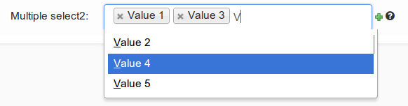
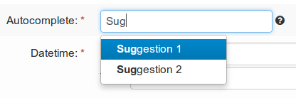
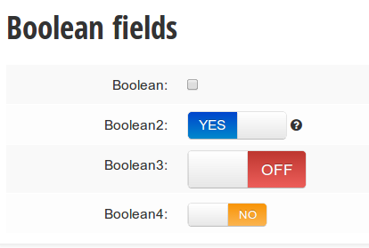

.. _custom-widgets:

Widgets
++++++++

yawd-admin implements some admin widgets for use in your applications.

Select2MultipleWidget widget
----------------------------

You can use this widget instead of the default `SelectMultipleWidget` for a
prettier multiple choice selection input.

.. code-block:: python

	from yawdadmin.widgets import Select2MultipleWidget

	class MyForm(forms.ModelForm):
	    class Meta:
	        widgets = {
	            'multiplefield': Select2MultipleWidget
	        }

AutoCompleteTextInput widget
----------------------------

yawd-admin implements a
`bootstrap typeahead <http://twitter.github.com/bootstrap/javascript.html#typeahead>`_
widget that you can use in your forms. As you type in the text input, the
widget will provide suggestions for auto-completing the field.

Say for example there is a ``Contact`` model having a field named
``profession``. You want the `profession` text input to suggest professions
while typing. First you should create a view that returns a json-serialized
object with the suggestions:

.. code-block:: python

	class TypeaheadProfessionsView(View):
	    def get(self, request, *args, **kwargs):
	        if not request.is_ajax():
	        raise PermissionDenied

	        query = request.GET.get('query', None)
	        results = []

	        for el in Contact.objects.values_list('profession', flat=True).distinct():
	            if el and (not query or el.find(query.decode('utf-8')) != -1):
	                results.append(el)

	        return HttpResponse(json.dumps({'results': results}))

As you type in the text field, the js code makes a get request to your custom view,
with the typed text being sent in the ``query`` `GET variable`. As you can
see from the code above, the dictionary returned by the view must have a
``results`` element that contains a list with all suggestions.

No suppose we register this view with the name `'profession-suggestions-view'`.
We can create a custom admin form for the ``Contact`` and override the
widget for the ``profession`` field as follows:

.. code-block:: python

	from yawdadmin.widgets import AutoCompleteTextInput

	class MyContactForm(forms.ModelForm):
	    class Meta:
	        widgets = {
	            'profession': AutoCompleteTextInput(source=reverse_lazy('profession-suggestions-view'))
	        }

Finally, in our admin.py we must force the ``Contact``'s model admin to use
the custom form:

.. code-block:: python

	class MyContactAdmin(admin.ModelAdmin)
		form = MyContactForm

Radio buttons
-------------

To use the built-in bootstrap-style radio buttons use the ``BootstrapRadioRenderer``
renderer:

.. code-block:: python

	from yawdadmin.widgets import BootstrapRadioRenderer

	class MyForm(forms.ModelForm):
	    class Meta:
	        widgets = {
	            'myselectfield': forms.RadioSelect(renderer=BootstrapRadioRenderer)
	        }

SwitchWidget
------------

The `SwitchWidget` can be used on Boolean Fields to display smartphone-style switches instead 
of checkboxes.

.. code-block:: python

	from yawdadmin.widgets import SwitchWidget

	class MyForm(forms.ModelForm):
	    class Meta:
	        widgets = {
	            'booleanfield': SwitchWidget
	        }

To change the button size use one of the following classes:

* switch-large
* switch-small
* switch-mini

.. code-block:: python

	from yawdadmin.widgets import SwitchWidget

	class MyForm(forms.ModelForm):
	    class Meta:
	        widgets = {
	            'booleanfield': SwitchWidget(attrs={'class': 'switch-small'})
	        }

By default the switch uses the labels `YES`/`NO` for on and off positions. You can override
the label text using the `data-on-label` and `data-off-label` attributes respectively:

.. code-block:: python

	from yawdadmin.widgets import SwitchWidget

	class MyForm(forms.ModelForm):
	    class Meta:
	        widgets = {
	            'booleanfield': SwitchWidget(attrs={'data-on-label': 'I\'M ON',
	            		'data-off-label': 'I\'M OFF',})
	           }

You can also change the color of the on and of positions using the `data-on` and `data-off`
attributes. The available color tokens are the following:

* primary
* info
* warning
* success
* danger
* default

.. code-block:: python

	from yawdadmin.widgets import SwitchWidget

	class MyForm(forms.ModelForm):
	    class Meta:
	        widgets = {
	            'booleanfield': SwitchWidget(attrs={'data-on': 'success',
	            			'data-off': 'danger',})
	           }
